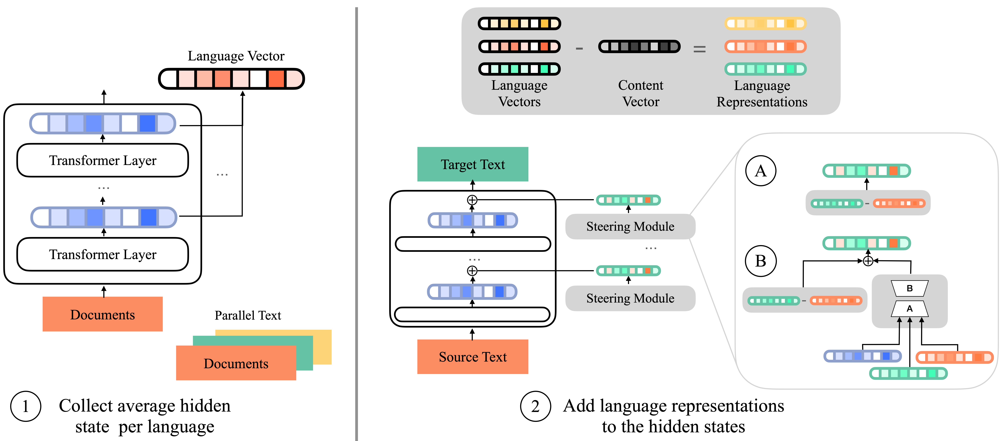

# ReCoVeR  

ReCoVeR (**Re**ducing language **Co**nfusion with **Ve**ctor **R**epresentations) is a lightweight **representation steering method** designed to mitigate **language confusion** in multilingual language models while maintaining strong task performance.  

This repository provides tools to:  
- Collect language-specific vectors  
- Apply them at inference time for controlled steering  
- Train enhanced vectors (ReCoVeR+) for improved performance  

  

---

## 🚀 Installation  

First, clone this repository and install the dependencies:  

```bash
git clone https://github.com/hSterz/recover.git
cd recover
pip install -r requirements.txt 
```

## Collecting Language Vectors

ReCoVeR requires average language vectors to perform representation steering.
These vectors can be collected using the `collect_language_vectors`.

### Steps:

1. Clone or download the collect_language_vectors repository.

2. Adapt the `collect_language_vectors\run.sh`
- our model name (e.g., Qwen/Qwen2-7B-Instruct)

- Dataset(s) used for language representation extraction

- Batch size and other parameters

3. Run the script!

This will output average representations per language, which can later be used for steering.

## Using Language Vectors
Once vectors are collected, they can be applied during inference.
Use the `Steering` class to load and apply vectors.

For evaluation, use the Language Confusion Benchmark (LCB) with the predict_lcb.py script.

```
python predict_lcb.py \
    --crosslingual \
    --alpha 1 \
    --beta 1 \
    --scaling norm \
    --restore_norm \
    --version recover \
    --model_name Qwen/Qwen2-7B-Instruct 
```

This outputs a csv file that can be evaluated with this [evaluation code](https://github.com/Cohere-Labs-Community/language-confusion/blob/main/compute_metrics.py).


## Training Language Vectors

In addition to static vectors, ReCoVeR+ provides trained steering vectors for enhanced performance.

Run the training script:
```
cd recover
train.sh
```
Evaluate with the same predict_lcb.py script, but pass the path to the trained steering module:
```
python predict_lcb.py \
    --crosslingual \
    --alpha 1 \
    --beta 0.9 \
    --scaling norm \
    --restore_norm \
    --version recover_plus \
    --model_name Qwen/Qwen2-7B-Instruct \
    --path <PATH_TO_STEER>
```


## Citation
```
@article{sterz2025recover,
    title={ReCoVeR the Target Language: Language Steering without Sacrificing Task Performance}, 
    author={Hannah Sterz and Fabian David Schmidt and Goran Glavaš and Ivan Vulić},
    year={2025},
    journal={arXiv preprint arXiv:2509.14814},
}
```